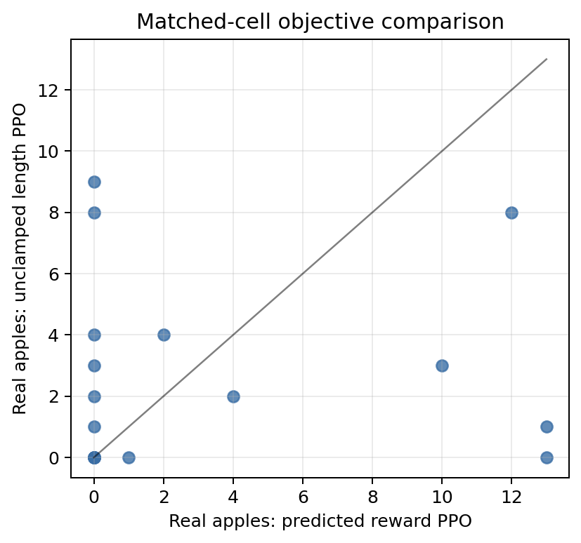

# Snake Hallucinated Worlds

Can a CNN learn to play Snake inside a learned visual world, then still play correctly in the real simulator?

This repo is a small, visual world-model research project. We train a Snake video/world model, train a CNN policy inside that hallucinated environment, then evaluate whether the policy transfers back to the true code simulator.

[Read the paper](paper.pdf)


## What this is

The world model sees a `128 x 128 x 3` RGB Snake frame and an action. It predicts the next frame plus two discrete events: whether the snake ate an apple and whether it died.

The point is not that Snake is hard. The point is that learned environments can be exploitable. A policy can look good inside the world model while failing in the real simulator, so we measure that hallucinated-vs-real transfer gap directly.

The GIF above shows the same action sequence rolled through the real simulator and the learned world model. The bottom row highlights drift as the rollout gets longer.


## Interactive world-model UI

The web UI lets you seed the learned world model from a custom starting board. Apples and rocks are editable; the snake start is fixed.


Run it locally after installing the package:

```bash
snake-inference --checkpoint runs/wm_5m_random_layout/latest.pt --location localhost:8055
```

Then open `http://localhost:8055`.

## Install

```bash
python -m pip install -r requirements.txt
python -m pip install -e .
```

## Four-command pipeline

Generate randomized-layout Snake data:

```bash
snake-generate-data \
  --out runs/datasets/snake_random_layout_50k \
  --max-transitions 50000 \
  --episodes 2500 \
  --randomize-apples \
  --randomize-rocks
```

Train the visual event world model:

```bash
snake-train-wm \
  --dataset runs/datasets/snake_random_layout_50k \
  --out runs/wm_5m_random_layout \
  --variant wm_5m \
  --steps 30000 \
  --batch-size 8 \
  --wandb-mode online
```

Run inference and the web UI:

```bash
snake-inference \
  --checkpoint runs/wm_5m_random_layout/latest.pt \
  --location localhost:8055
```

Train a CNN PPO agent inside the frozen world model:

```bash
snake-train-cnn-agent \
  --dataset runs/datasets/snake_random_layout_50k \
  --world-model runs/wm_5m_random_layout/latest.pt \
  --out runs/policies/wm_5m_small_hard \
  --policy small \
  --updates 250 \
  --reward-decoder hard \
  --wandb-mode online
```

## Results at a glance

World-model drift matters more than one-step frame loss alone. The policy optimizer can discover mistakes that are not obvious from static validation metrics.


The paper compares hallucinated training performance against real-simulator evaluation across world-model size, context length, policy size, and reward objective.



## Repo layout

```text
src/        Python package and CLI entrypoints
images/     GitHub README visuals
papers/     LaTeX source, paper figures, tables, and references
paper.pdf   compiled paper draft
```

Large generated artifacts are intentionally not committed. Checkpoints, datasets, W&B local logs, and `.npy` arrays should stay local or in external artifact storage.

## W&B

Event-model project:

<https://wandb.ai/anothervibecoder-i-unemplyed/snake-hallucinated-worlds-event>
