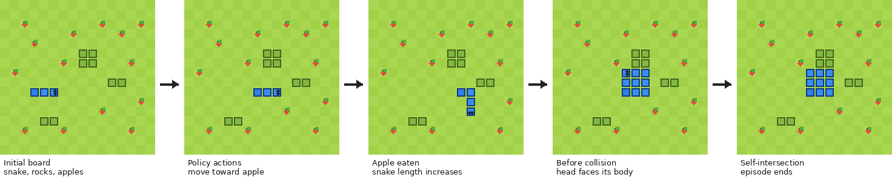
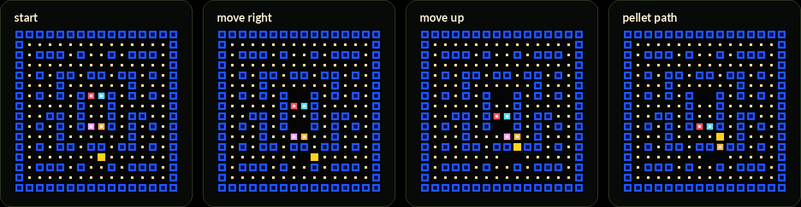
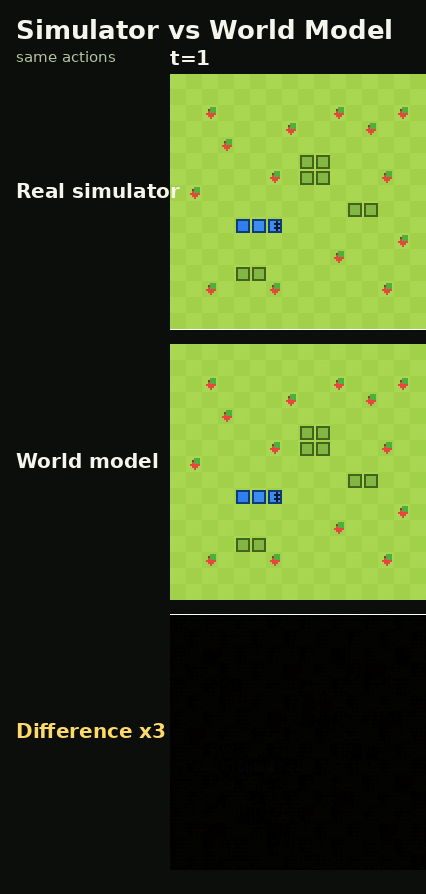
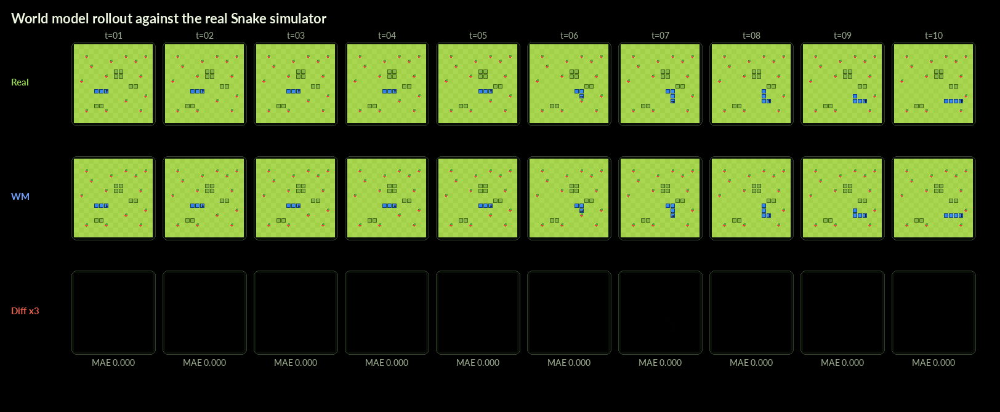
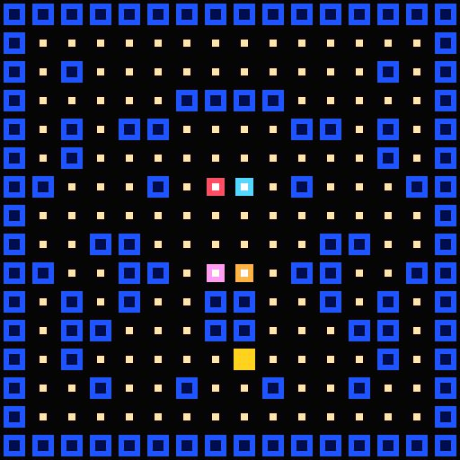
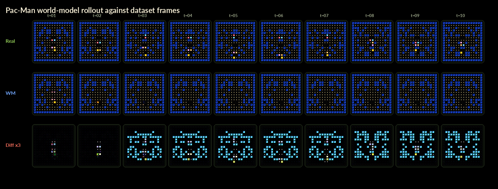
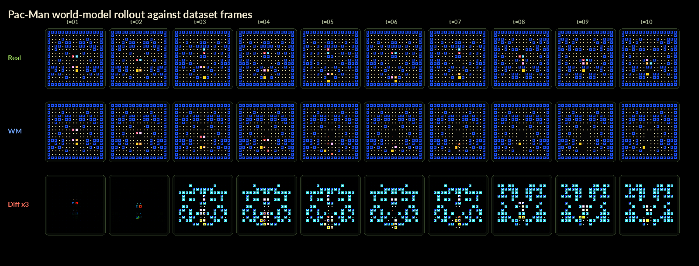
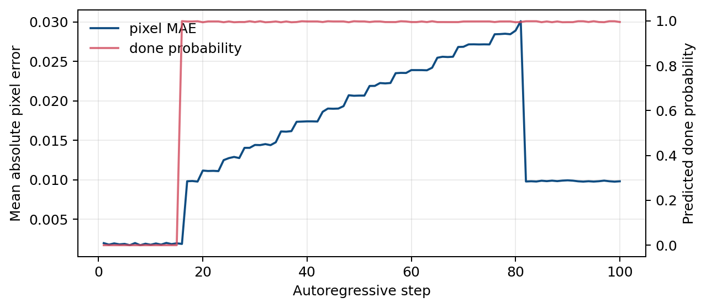
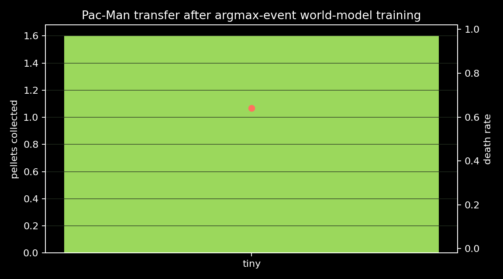

# Discrete Event Rewards in Learned Visual Worlds

Can a CNN policy learn inside a learned video world, then still work in the real simulator?

This repo is a visual world-model research project using two grid games:

- Snake as the clean proof of concept.
- Pac-Man as the harder stress test with moving ghosts, randomized connected mazes, and denser visuals.

The key design change is simple: the world model predicts the next RGB frame plus discrete event logits. PPO receives hard `argmax` rewards, not fractional learned rewards.

[Read the paper](paper.pdf)





## What this is

The world model sees an RGB game frame and an action. It predicts:

- the next RGB frame,
- whether the reward item was collected,
- whether the agent died.

The point is not that Snake or Pac-Man require learned simulators. The point is to measure when a CNN trained in a learned visual simulator transfers back to the true code simulator.

Snake works as a sanity check. A one-frame event world model is good enough for PPO to train a CNN policy that transfers to the real Snake simulator.





Pac-Man is harder. A tiny Pac-Man world model is exploitable even with hard `argmax` rewards: hallucinated evaluation reports about 244 pellets, while real random-map evaluation collects about 1.6 pellets. Larger world models remove most of the hallucinated reward explosion, but still do not train a strong transferred Pac-Man policy.







## Interactive world-model UI

The web UI lets you seed the learned world model from a custom starting board. Apples and rocks are editable; the snake start is fixed.


Run it locally after installing the package:

```bash
snake-inference --checkpoint runs/wm_5m_random_layout/latest.pt --location localhost:8055
```

Then open `http://localhost:8055`.

## Install

```bash
python -m pip install -r requirements.txt
python -m pip install -e .
```

## Four-command pipeline

Generate randomized-layout Snake data:

```bash
snake-generate-data \
  --out runs/datasets/snake_random_layout_50k \
  --max-transitions 50000 \
  --episodes 2500 \
  --randomize-apples \
  --randomize-rocks
```

Train the visual event world model:

```bash
snake-train-wm \
  --dataset runs/datasets/snake_random_layout_50k \
  --out runs/wm_5m_random_layout \
  --variant wm_5m \
  --steps 30000 \
  --batch-size 8 \
  --wandb-mode online
```

Run inference and the web UI:

```bash
snake-inference \
  --checkpoint runs/wm_5m_random_layout/latest.pt \
  --location localhost:8055
```

Train a CNN PPO agent inside the frozen world model:

```bash
snake-train-cnn-agent \
  --dataset runs/datasets/snake_random_layout_50k \
  --world-model runs/wm_5m_random_layout/latest.pt \
  --out runs/policies/wm_5m_small_hard \
  --policy small \
  --updates 250 \
  --reward-decoder hard \
  --wandb-mode online
```

Pac-Man uses the same event-model pipeline:

```bash
pacman-generate-data \
  --out runs/datasets/pacman_random_30k \
  --max-transitions 30000 \
  --random-map
```

```bash
snake-train-wm \
  --dataset runs/datasets/pacman_random_30k \
  --out runs/pacman_argmax_matrix/world_models/wm_2m \
  --variant wm_2m \
  --steps 16000 \
  --batch-size 16 \
  --wandb-mode online
```

```bash
snake-train-cnn-agent \
  --dataset runs/datasets/pacman_random_30k \
  --world-model runs/pacman_argmax_matrix/world_models/wm_2m/latest.pt \
  --out runs/pacman_argmax_matrix/policies/wm_2m_small_hard \
  --policy small \
  --updates 180 \
  --reward-decoder hard \
  --wandb-mode online
```

```bash
pacman-evaluate-policy \
  --policy runs/pacman_argmax_matrix/policies/wm_2m_small_hard/latest.pt \
  --out runs/pacman_argmax_matrix/evals/wm_2m_small_hard_real_random \
  --mode real \
  --random-map
```

## Results at a glance

World-model drift matters more than one-step frame loss alone. The policy optimizer can discover mistakes that are not obvious from static validation metrics.



The paper compares hallucinated training performance against real-simulator evaluation under the hard event-reward interface.



## Repo layout

```text
src/        Python package and CLI entrypoints
images/     GitHub README visuals
papers/     LaTeX source, paper figures, tables, and references
paper.pdf   compiled paper draft
```

Large generated artifacts are intentionally not committed. Checkpoints, datasets, W&B local logs, and `.npy` arrays should stay local or in external artifact storage.

## W&B

Snake event-model project:

<https://wandb.ai/anothervibecoder-i-unemplyed/snake-hallucinated-worlds-event>

Pac-Man event-model project:

<https://wandb.ai/anothervibecoder-i-unemplyed/snake-hallucinated-worlds-pacman>
