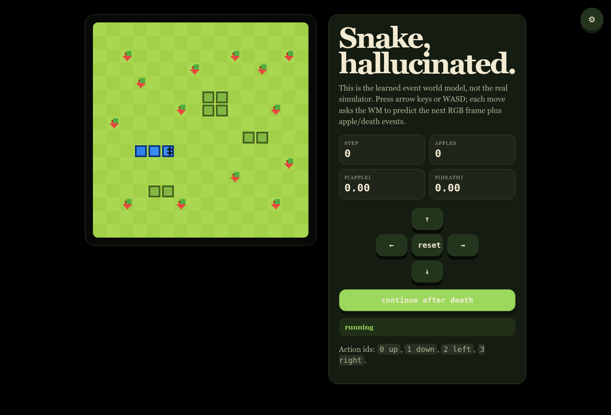
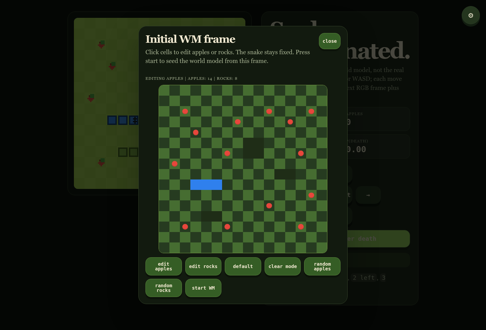

# Snake hallucinated-world implementation

This folder contains the runnable code for the Snake world-model experiments.
It is intentionally separated from the paper source so the implementation can be installed, tested, and read without paper-build artifacts.

The current pipeline trains an event-conditioned visual world model. Given the previous RGB frame and an action, the model predicts:

- the next `128 x 128 x 3` RGB frame;
- whether the move eats an apple;
- whether the move kills the snake.

The web UI can seed the world model from a custom initial frame. Apples and rocks are editable; the snake start is fixed for now.

## Install

```bash
cd implementation
python -m pip install -r requirements.txt
python -m pip install -e .
```

The package installs four console commands:

- `snake-generate-data`
- `snake-train-wm`
- `snake-inference`
- `snake-train-cnn-agent`

Equivalent wrapper scripts are also provided in `implementation/scripts/`.

## 1. Generate data

```bash
snake-generate-data \
  --out runs/datasets/snake_random_layout_50k \
  --max-transitions 50000 \
  --episodes 2500 \
  --randomize-apples \
  --randomize-rocks \
  --apple-count 14 \
  --rock-count 8
```

Key options:

- `--max-transitions`: target number of transition examples.
- `--episodes`: maximum number of simulator episodes to roll out.
- `--randomize-apples`: sample apple positions independently per episode.
- `--randomize-rocks`: sample rock positions independently per episode.
- `--apple-count` and `--rock-count`: object counts used during randomized layout generation.

## 2. Train the world model

```bash
snake-train-wm \
  --dataset runs/datasets/snake_random_layout_50k \
  --out runs/wm_5m_random_layout \
  --variant wm_5m \
  --steps 30000 \
  --batch-size 8 \
  --wandb-mode online
```

Available event-world-model sizes:

| Variant | Parameters | Use |
|---|---:|---|
| `tiny` | about 0.04M | smoke tests |
| `wm_1m` | about 1.12M | fast baseline |
| `wm_2m` | about 2.23M | medium baseline |
| `wm_5m` | about 5.46M | randomized apple/rock model |

## 3. Run inference / web UI

```bash
snake-inference \
  --checkpoint runs/wm_5m_random_layout/latest.pt \
  --location localhost:8055
```

Then open `http://localhost:8055`.

The settings button opens the initial-frame editor. Move apples or rocks, then press `start WM` to roll the learned model forward from that custom image.





## 4. Train the CNN agent inside the WM

```bash
snake-train-cnn-agent \
  --dataset runs/datasets/snake_random_layout_50k \
  --world-model runs/wm_5m_random_layout/latest.pt \
  --out runs/policies/wm_5m_small_hard \
  --policy small \
  --updates 250 \
  --reward-decoder hard \
  --wandb-mode online
```

Key options:

- `--policy`: `small`, `medium`, or `large` CNN policy.
- `--updates`: PPO update count.
- `--reward-decoder hard`: use argmax apple-event reward.
- `--reward-decoder prob`: use probability-of-apple reward for comparison experiments.
- `--minibatch-size`: reduce this on smaller GPUs.

## Current recommended local run

```bash
snake-generate-data --out runs/datasets/snake_random_layout_50k --max-transitions 50000 --episodes 2500 --randomize-apples --randomize-rocks
snake-train-wm --dataset runs/datasets/snake_random_layout_50k --out runs/wm_5m_random_layout --variant wm_5m --steps 30000 --batch-size 8 --wandb-mode online
snake-inference --checkpoint runs/wm_5m_random_layout/latest.pt --location localhost:8055
snake-train-cnn-agent --dataset runs/datasets/snake_random_layout_50k --world-model runs/wm_5m_random_layout/latest.pt --out runs/policies/wm_5m_small_hard --policy small --updates 250 --reward-decoder hard --wandb-mode online
```

## W&B

Default event-model project:

<https://wandb.ai/anothervibecoder-i-unemplyed/snake-hallucinated-worlds-event>

```bash
export WANDB_ENTITY=anothervibecoder-i-unemplyed
export WANDB_PROJECT=snake-hallucinated-worlds-event
```

## Source layout

The implementation package intentionally keeps only the current event-model pipeline:

- `env.py`: Snake simulator and renderer.
- `generate_dataset.py`: randomized apple/rock data generation.
- `event_model.py`: event world-model architecture.
- `models.py`: shared neural-network blocks.
- `train_event_world_model.py`: WM training loop.
- `serve_event_world_model.py`: local inference server and web UI.
- `train_event_policy.py`: PPO CNN agent training inside the WM.
- `evaluate_event_policy.py`: real-simulator evaluation helper.
